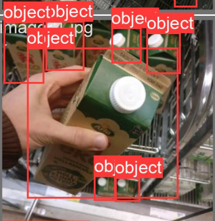
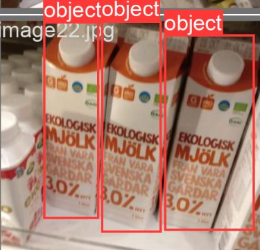
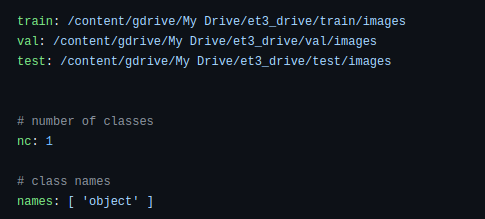
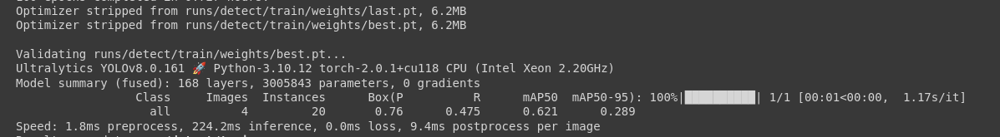
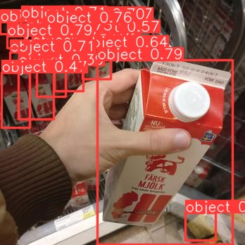
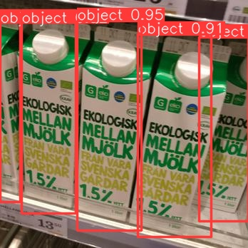

# eT3-assessment-BigData

## Getting Started

Follow these steps to get started with the Colab notebook:

1. **Clone the Repository:**
   Begin by cloning this repository to your local machine. Open a terminal and run the following commands:

   ```
   git clone https://github.com/MahmoudAlaa123/eT3-assessment-BigData.git

2. **Navigate to the Repository:** Change the current working directory to the cloned repository's folder:

   ```
   cd eT3-assessment-BigData


## Problem 1: Image Data Processing Script

This script is designed to copy images from a source folder to a destination folder while collecting details such as image size and modification date. The collected information is then presented in a DataFrame and optionally returned for further processing.

## Usage

1. Install Dependencies:
   Make sure you have the required libraries installed.

   ```
   pip install pandas

2. Run the Script:
To run the script, use the following command in your terminal:

   ```
    python3 eT3_problem1.py source_folder_path destination_folder_path 

Replace `source_folder_path` with the path to the source folder containing images, and `destination_folder_path` with the path to the destination folder where images will be copied.

3. Output:
The script will copy images from the source folder to the destination folder while collecting details such as image size and modification date. The collected information is presented in a DataFrame and written into a CSV file in the destination folder.


# Detection System for Photo Analysis

The main goal is to develop a model that accurately identifies and locates specific objects within images. The process involves data annotation, dataset organization, and training a YOLOv8 model.

## Running the Code

The core of this project is provided in the notebook named `yolov8.ipynb`. We recommend running this notebook in Google Colab, a cloud-based Jupyter notebook environment. Google Colab provides the necessary resources for training deep learning models, making it easier to manage the computational demands of this project.

 [Open in Google Colab](yolo.ipynb).

**Note:** Variables need to be changed based on your environment: ```ROOTDIR```,  ```output_folder``` , ```input_folder```   (if you don't want to change them you have to make the exact path that I did)


```predict model```, ```source``` (in the prediction command) based on the output of the model


## Data Annotation

The dataset was annotated using makesense.ai, a versatile and efficient platform for annotating data. This involved carefully marking objects of interest within images to create ground truth labels for model training. To help you understand the annotation process, two annotated examples are included in the repository.




## Dataset Division

To ensure effective model training and evaluation, we divided the dataset into three categories:

- **Training Dataset:** 29 photos
- **Validation Dataset:** 4 photos 
- **Testing Dataset:** 3 photos 

This 80-10-10 split ratio ensures the model is trained on a substantial dataset, validated on unseen data, and tested on a separate set of images to assess its generalization performance.

## Custom Configuration

To customize the YOLOv8 model for training on our dataset, utilize the `custom_data.yaml` file. This file includes dataset paths, model parameters, and hyperparameters. Tailoring the model in this manner ensures it's well-suited for our data's characteristics and the specific detection task.



**Note:** Before running the notebook, make sure to upload your annotated dataset to your Google Drive and adjust the paths accordingly in the notebook by providing the path to the images, and don't change the name of the folders.

## Model Training

The YOLOv8 architecture was chosen for its effectiveness in object detection tasks, especially when working with limited data samples. The training process spanned 100 epochs, allowing the model to progressively learn and refine its detection capabilities.

## Model Validation 

We can see the validation data set achieved 0.625 in the mean average precision after 100 epochs using the CPU capabilities 



## Model Testing 

Predictions to 3 photos that the model has never seen them






## Converting Testing Data to JSON Format and Storing it on Google Drive

The last 2 cells in the notebook will convert the label of test data generated by the model prediction to JSON format and save the resulting JSON files to the `output_json` folder in Google Drive.

Once the conversion process is complete, you can access the JSON files in the `output_json` folder on your Google Drive. These files are now in a structured format that is suitable for further analysis.


